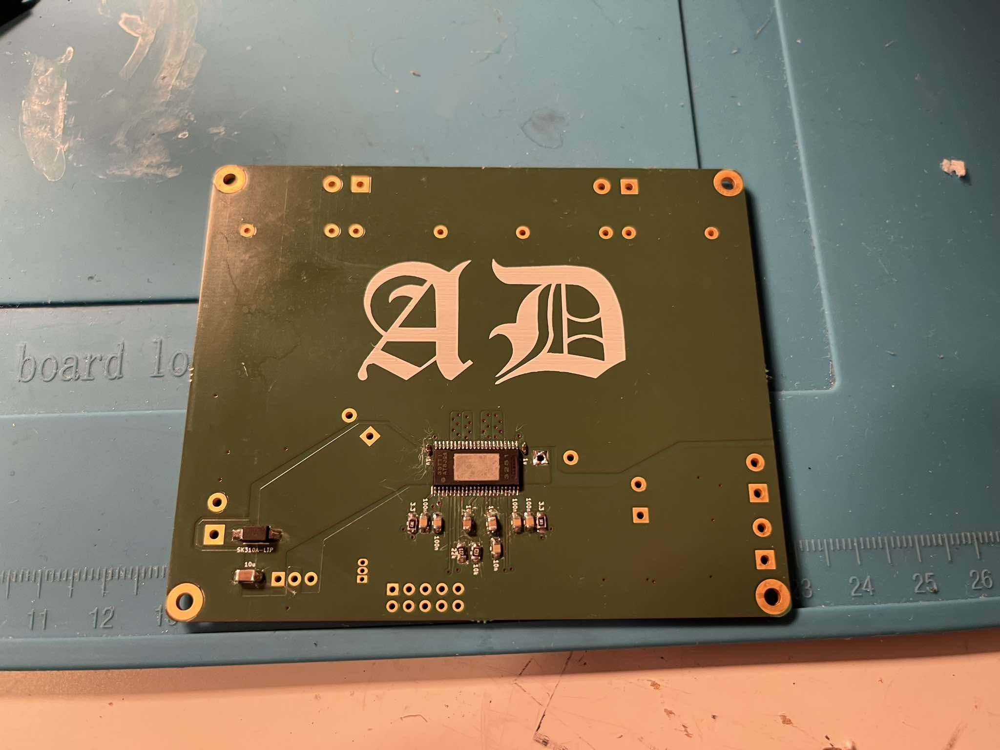

TPA3251-based power amplifier, 2x150W
=====================================

* [View schematic in KiCanvas](https://kicanvas.org/?github=https%3A%2F%2Fgithub.com%2Fpstiasny%2Fpoweramp-TPA3251%2Fblob%2Fmain%2Famp.kicad_sch)
* [View board in KiCanvas](https://kicanvas.org/?github=https%3A%2F%2Fgithub.com%2Fpstiasny%2Fpoweramp-TPA3251%2Fblob%2Fmain%2Famp.kicad_pcb)

## Notes

*  Amplifier chip is placed on the bottom side.  That design allows for thermal coupling to chassis.
*  I had the board bend a little.  Might be better balanced without the bottom layer ground plane.
*  DC relative to power ground will be present on the ouput terminals.  Add AC coupling capacitors
   in series if that is undesired.
